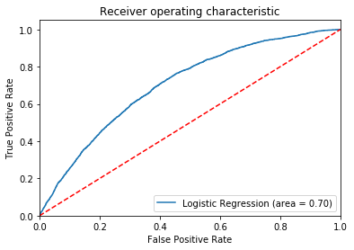

[](http://quantlet.de/)

## [](http://quantlet.de/) **LogReg_AUC** [](http://quantlet.de/)

```yaml

Name of QuantLet : LogReg_AUC

Published in : SPL

Description : Builds a Logistic Regression Model and calculates the Area under Curve 
	      as well as draws the ROC-Curve

Keywords : 'logistic regression, AUC, ROC'

Author : Tobias Blücher, Niklas Kudernak, Sydney Richards

```




### Pyhton Code:
```python


########## Statisitcal Programming Languagues SS 2018 ##########
########## Project: Credit Risk Scorecard in Python   ##########
########## Members: Tobias Blücher, Niklas Kudernak  ##########
##########          Sydney Richards                   ##########
########## 
# Project Design: To create a Scorecard to classify Customer   #
# Loan applications according to the charactheristics of the   #
# applicant. While the grouping shall be done using a Logistic #
# Regression. The scorecard that is develpod should be usuable #
# by non statisticians, since Lending Club is a peer-to-peer   #
# platform.

#### Dataset: Kaggle Competition kaggle datasets download -d wendykan/lending-club-loan-data
#### Use the Kaggle API to download dataset files.
#### https://github.com/Kaggle/kaggle-api 
#### Link: https://www.kaggle.com/wendykan/lending-club-loan-data/data


#### Packages Required
import pandas as pd
import numpy as np
from sqlalchemy import create_engine
from sklearn import preprocessing 
from sklearn.metrics import roc_auc_score
import statsmodels.api as sm
import statsmodels.tools as smt
import matplotlib.pyplot as plt


######################## Step 1: Data Import ##################################                

### Set file path to local directory
data_path = 'C:\\Users\\sydma\\Dropbox\\Uni Sach\Master\\SoSe_18\\Statistical Programming Languages\\Topic\\Loan_Club\\'
### Connect to SQL engine
engine = create_engine('sqlite:///' + data_path +'database.sqlite')
### Load Dataset
df = pd.read_sql('SELECT * FROM loan' ,engine)

### Organize & First Look 
cols=sorted(df.columns)
df[cols[1:25]].head()
df.info()
### Drop iffy loan_status

status = ['Issued','Does not meet the credit policy. Status:Charged Off',
                    'Does not meet the credit policy. Status:Fully Paid']
df = df[~df['loan_status'].isin(status)]

############# Take sample and define dafualt ###################

######################## Step 2: Create Sample ################################  

### create sample of 50000 obs with random_state(seed)
df_sample =df.sample(50000,random_state = 1)
### Only select useful columns
df_sample = df_sample[cols]

### Convert Date Cols
df_sample['last_pymnt_d'] = pd.to_datetime(df_sample['last_pymnt_d'])
df_sample['earliest_cr_line'] = pd.to_datetime(df_sample['earliest_cr_line'])
### latest obervation in dataset is '31/01/2016/' Calc Credit History
df_sample['final_snp_date'] =  pd.to_datetime('31/01/2016/')
### Length of Credit History in Years
df_sample['cr_hist_yr']=(df_sample['final_snp_date'].dt.to_period('M') - df_sample['earliest_cr_line'].dt.to_period('M')) / 12
### Convert to float 
df_sample['cr_hist_yr'] = df_sample['cr_hist_yr'].astype(float)


### Create default charactersitic: Default and 30+ dpd
print(df_sample['loan_status'].unique())
### Questions: What is charged off ? 
### Charged Off means in goes into collections 150+ dpd default
### Does not meet the credit policy ? 
pass_criteria = ['Current', 'Fully Paid','In Grace Period',
                    'Late (16-30 days)', 'Issued','Late (31-120 days)']

df_sample['default'] = np.where(np.isin(df_sample['loan_status'],pass_criteria),0,1)


######################## Step 4: Model Training  ############################## 

### After Selecting the characteristics a model is built for the eventual 
### scorecard classification a logistic regression model is used
### a constant is included in the model
### the sklearn package from which the logistic regression model is taken
### requires that all variables are encoded as numerical variables
### in this function a graph is also included along with the  AUC of the model
def Logistic_Regression_Analysis(model_vars,continous_vars = []):
    
    le = preprocessing.LabelEncoder()
    y = df_sample['default'].reset_index(drop=True)
    X = pd.DataFrame([])
    for var in model_vars:
        X[var]= le.fit_transform(df_sample[var])
    
    for i in continous_vars:
        X[i]= df_sample[i].reset_index(drop=True)
        
    #Add Constant
    X = smt.add_constant(X)
    # Regression Analysis
    logit_model=sm.Logit(y,X)
    result=logit_model.fit(disp=0)    
    
    from sklearn.metrics import roc_curve
    logit_roc_auc = roc_auc_score(y, result.predict())
    fpr, tpr, thresholds = roc_curve(y, result.predict())
    plt.figure()
    plt.plot(fpr, tpr, label='Logistic Regression (area = %0.2f)' % logit_roc_auc)
    plt.plot([0, 1], [0, 1],'r--')
    plt.xlim([0.0, 1.0])
    plt.ylim([0.0, 1.05])
    plt.xlabel('False Positive Rate')
    plt.ylabel('True Positive Rate')
    plt.title('Receiver operating characteristic')
    plt.legend(loc="lower right")
    plt.show()
    print('AUC Score: '+str(logit_roc_auc))
    return result

model_vars = ['term','home_ownership','grade','purpose','emp_length',]
continous_vars = ['funded_amnt','dti']
results = Logistic_Regression_Analysis(model_vars,continous_vars)

```