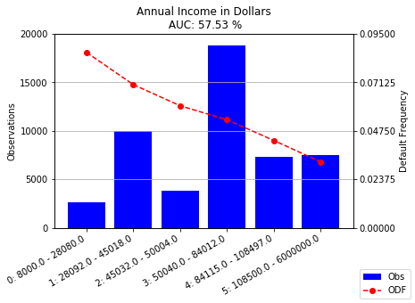
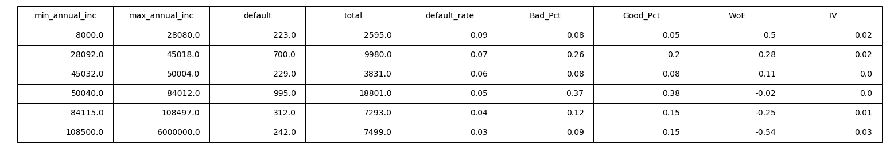

[](http://quantlet.de/)

## [](http://quantlet.de/) **varAUC** [](http://quantlet.de/)

```yaml

Name of QuantLet : varAUC

Published in : SPL

Description : Checks the predictive power of single characteristics.
              Shows the Observed default frequency across characteristic classes.

Keywords : 'logistic regression, AUC, odf, default risk'

Author : Tobias Blücher, Niklas Kudernak, Sydney Richards

```




### Pyhton Code:
```python

########## Statisitcal Programming Languagues SS 2018 ##########
########## Project: Credit Risk Scorecard in Python   ##########
########## Members: Tobias Blücher, Niklas Kudernak  ##########
##########          Sydney Richards                   ##########
########## 
# Project Design: To create a Scorecard to classify Customer   #
# Loan applications according to the characteristics of the    #
# applicant. While the grouping shall be done using a Logistic #
# Regression. The scorecard that is developed should be usable #
# by non statisticians, since Lending Club is a peer-to-peer   #
# platform.													   # 
# For this reason all numerical variables used for classifi-   #
# cation should be grouped into categories that optimize       #
# their explanatory power.                                     #
#### Dataset: Kaggle Competition kaggle datasets download -d wendykan/lending-club-loan-data
#### Link: https://www.kaggle.com/wendykan/lending-club-loan-data/data
#### Packages Required
import pandas as pd
import numpy as np
from sqlalchemy import create_engine
import scipy.stats as st

import statsmodels.api as sm
import statsmodels.tools as smt
import matplotlib.pyplot as plt


import itertools
from sklearn import svm, datasets
from sklearn.model_selection import train_test_split
from sklearn.metrics import confusion_matrix
from sklearn.metrics import brier_score_loss
from sklearn import preprocessing 
from sklearn.metrics import roc_auc_score
from collections import OrderedDict


import plotly.plotly as py
import plotly 

#### Initializes credentials used for creating graphs in plotly
plotly.tools.set_credentials_file(username='SPL2018SS', api_key='X8qHACTMQmxmmsnQNfmD')

######################## Step 1: Data Import ##################################          
# In our 1st Step we define our data connection and load the   #
# data from a SQLite engine. This is preferable to say a csv   #
# since it insures data consistency and is generally quicker.  #
# Furthermore we drop loans which due to their loan_satus      #
# cannot be used for credit risk analysis since they are not   #
# active or have been classified as frauds.                    #

### Set file path to local directory

data_path = 'C:\\Users\\sydma\\Dropbox\\Uni Sach\Master\\SoSe_18\\Statistical Programming Languages\\Topic\\Loan_Club\\'
### Connect to SQL engines


engine = create_engine('sqlite:///' + data_path +'database.sqlite')

### Load Dataset
df = pd.read_sql('SELECT * FROM loan' ,engine)

### Organize & First Look 

cols=sorted(df.columns)
df[cols[1:25]].head()
df.info()

### Drop iffy loan_status
### We cannot use loans for risk analysis which either have just been issued
### or that didn't meet Lending Club's credit policy possibly due to fraud.
status = ['Issued','Does not meet the credit policy. Status:Charged Off',
                    'Does not meet the credit policy. Status:Fully Paid']
df = df[~df['loan_status'].isin(status)]


######################## Step 2: Create Sample ################################  
# Secondly, we create a sample from our dataset on which we will #
# conduct our analysis. Since our dataset is very large we       #
# for performance reasons run our    script on a representative  #
# subset of the original data.                                   #

### create sample of 50000 obs with random_state(seed)
df_sample = df.sample(50000,random_state = 1)

### Only select useful columns
df_sample = df_sample[cols]

### Convert Date Cols

df_sample['last_pymnt_d'] = pd.to_datetime(df_sample['last_pymnt_d'])
df_sample['earliest_cr_line'] = pd.to_datetime(df_sample['earliest_cr_line'])

### latest observation in dataset is '31/01/2016/' Calc Credit History
df_sample['final_snp_date'] =  pd.to_datetime('31/01/2016/')

### Length of Credit History in Years
df_sample['cr_hist_yr']=(df_sample['final_snp_date'].dt.to_period('M') - df_sample['earliest_cr_line'].dt.to_period('M')) / 12

### Convert to float 
df_sample['cr_hist_yr'] = df_sample['cr_hist_yr'].astype(float)


### Create default characteristic: 
# For our analysis we need to clearly define whether a loan has  #
# been paid back or not. We could do this in different ways:     #
# 1. compare last payment date to payment schedule and see if    #
# 	 loan is overdue. [Days past due] - dpd                      #
# 2. lending club provides a loan status in the data set which   #
#    can use for determining defaults.                           #
# We choose the latter option and create a new column 'default'  #
# Which indicates 1 - default									 #
#				  0  - non-default								 #

print(df_sample['loan_status'].unique())
### Question: What is charged off ? 
### => Charged Off means in goes into collections 150+ dpd default
### Question: Does not meet the credit policy ? 
### => Was recognized as a fraudulent loan application

pass_criteria = ['Current', 'Fully Paid','In Grace Period',
                    'Late (16-30 days)', 'Issued','Late (31-120 days)']

df_sample['default'] = np.where(np.isin(df_sample['loan_status'],pass_criteria),0,1)


######################## Step 3: Clean Sample ################################ 
# Before we begin with our analysis we organize the data.         #
# The dataset includes many missing values we we will             #
# re categorize. Also we look more closely at continuous          #
# variables with less than with less than 100 unique observations #
# Next, we convert % values which are stored as string into       #
# numeric variables.                                              #
# Lastly, we look for highly correlated variables for which       #
# will include only 1 into our analysis.                          #


### Create a list of suspect variables
suspect = []
for numeric_var in df_sample.columns:
     if  (df_sample[numeric_var].dtype == 'float64' and
     len(df_sample[numeric_var].unique()) < 100):
                suspect.append(numeric_var)

print(suspect)                

### List of variables to be dropped
vars_to_drop = [ 'acc_now_delinq',
                 'application_type', # too few joints to make a difference
                 'all_util',
                 'annual_inc_joint',
                 'desc',
                 'collection_recovery_fee', # no interest in collection
                 'collections_12_mths_ex_med',
                 'open_acc_6m',
                 'open_il_12m',
                 'open_il_24m',
                 'open_il_6m',
                 'open_rv_12m',
                 'open_rv_24m',
                 'policy_code',
                 'max_bal_bc',
                 'last_pymnt_d',#since we have loan_satus we don't need
                 'next_pymnt_d',#also not useful
                 'dti_joint',
                 'inq_fi',
                 'il_util',
                 'inq_last_12m',
                 'inq_last_6mths',
                 'total_bal_il',
                 'total_cu_tl',
                 'tot_coll_amt',
                 'url', 
                 'verification_status',
                 'verification_status_joint',
                 'member_id' #drop cause df['member_id'].nunique = obs
                 ,'id']
df_sample = df_sample.drop(vars_to_drop,axis=1)


### Dealing with Null


### Create a list of variables with missing values
nanCol = []
for col in df_sample.columns:
    if df_sample[col].hasnans == True:
            nanCol.append(col)
            
### Dealing with missing Type 1
# for these columns null values can be replaced by 0 #
mth_dlq =    ['mths_since_last_delinq',
              'mths_since_last_major_derog',
              'mths_since_last_record',
              'mths_since_rcnt_il', 
              'tot_cur_bal', # is 0 if customer has no loans
              'total_rev_hi_lim'] # is 0 if customer has no loans
for col in mth_dlq:
   df_sample[col] = df_sample[col].fillna(0)
   
### Dealing with missing Type 2
# We replace missing emp_title- Employment Title by 'Unemployed' #
df_sample['emp_title'] = df_sample['emp_title'].fillna('Unemployed')
   
### Convert %-Strings to Float
df_sample['revol_util'] = df_sample['revol_util'].str.replace('%','').astype(float)

### Old Credit Line => 0 Denominator => Replace with 0
df_sample[np.isnan(df_sample['revol_util'])]
df_sample['revol_util'] = df_sample['revol_util'].fillna(0)

### Convert Interest Rate to Float
df_sample['int_rate'] = df_sample['int_rate'].str.replace('%','').astype(float)


### Calculate Simple Correlation Matrix 
# We Calculate a correlation matrix and visualize it #


corr = df_sample.corr(method='pearson')

import seaborn as sns
plt.subplots(figsize=(20,15))
sns.heatmap(corr)

### Can be dropped due to high correlations
vars_to_drop =  ['funded_amnt_inv',
                'installment',
                'loan_amnt',
                'total_pymnt',
                'total_pymnt_inv',
                'out_prncp_inv',
                'total_rec_int']
				
df_sample = df_sample.drop(vars_to_drop,axis=1)


######################## Step 4: Selecting Characteristics #################### 
# This is a crucial step in the scorecard development process.    #
# In order to end up with a scorecard that does not only have     #
# a predictive power but is also easy to use by non-statisticians #
# it is important to select characteristics which are not only    #
# related to the default probability but also are categorized     #
# so that the relationship between defaults and the variable      #
# is easy to follow.									          #


################ A: Evaluating Characteristics #################################

# In order to evaluate characteristics we use the Area under Curve#
# of the Receiver Operating Characteristic for a single variable  #
# model. While such a model should not be                         #
# used for default prediction it allows use to judge whether or   #
# not to include the characteristic under consideration.          #
# As a rule of thumb a characteristic can be judged as follows:   #
# - AUC > 60 very powerful characteristic should definitely be    #
# 		included											      #
# - AUC > 55 powerful characteristic should be included even if   #
#		  correlated with another variable						  #
# - AUC > 52 moderate characteristic should if it adds new insight#
#		  into quality of loan applicant   						  #		
#		  correlated with another variable						  #
# The following functions are used throughout the script to       #
# for characteristic evaluation                                   #	


######## Function 1: Calculate Single VAR AUC ########
# Initially, we would like to now what is the Observed Default   #
# Frequency (ODF) for each attribute of a given characteristic.  #	
# We can than see if there are differences among the different   #
# Attributes of a the characteristic.                            #
#Input: pd.Series containing variable to be observed             #
#Output pd.Series containing ODFs with Attributes as index       #

def Calc_Default_Freq_Cat(cat_var):
    return df_sample['default'].groupby(cat_var).sum() / cat_var.value_counts()


######## Function 2: Calculate Single VAR AUC ########
# We measure the predictive power of the characteristic using AUC#
# For this we need to set up a Logistic_Regression_Analysis with #	
# a constant and a single characteristic.					     #
# Attributes of a the characteristic.                            #
# To this end we use the statsmodels package in Python which is  #
# concise and easy to implement.							     #
# For the model to work we need to encode the values of our      #
# characteristic.                                                #
# Our functions checks if the Matrix of characteristic and 		 #
# constant is non-singular and invertible                        #                                                		 #
#Input: pd.Series containing variable to be observed             #
#Output: scalar containing AUC Score                             #

def single_VAR_AUC(cat_var):
    #Label Encoder
    le = preprocessing.LabelEncoder()
    #Declare Variables
    y = df_sample['default']
    X = smt.add_constant(le.fit_transform(cat_var))
    # Regression Analysis
    if np.isfinite(np.linalg.cond(X)): # Check for non-singular matrix
        logit_model=sm.Logit(y,X)
        result=logit_model.fit(disp=0)
        
        X = le.fit_transform(cat_var)
        
        return round(roc_auc_score(y, result.predict())*100,2)
    else:
        print('Matrix is not invertible')
        return 0


######## Function 3: Create Histograms for Categorical Vars ########
# We visualize the the behavior of the ODFs across Attributes    #
# Ideally we look for large differences within groups.           #	
# Large Differences in the ODF among attributes imply that       #
# the characteristic can be used to discriminate between         #
# which will pay back their loan and applicants which will not.  #
# Ideally there exist a minimum "statistical mass" of            #
# observations in each attribute. Such that if the model is used #
# in the future these attributes do not become obsolete.         #
# The AUC is displayed above the chart.                          #
#Input: x: pd.Series containing variable to be observed          #
#       Title: Title of the Diagram                              #
#Output: Histogram with number of Observations and ODF across    #
#        Attributes												 #		
    
def hist_cat(x,Title):
    #call single_VAR_AUC function
    auc = single_VAR_AUC(x)
	#calculate ODF
    odf = Calc_Default_Freq_Cat(x).sort_index()
    freq_x = x.value_counts().sort_index()
    digits = len(str(max(freq_x)))-1
    fig, ax1 = plt.subplots()
	
    ax1.bar(freq_x.index.astype(str),freq_x, color='blue'
             ,alpha=1,label='Obs')
    ax1.set_title(Title + '\n AUC: ' + str(auc) +' %' )
    ax1.set_ylabel('Observations')
    ax1.yaxis.grid()
    plt.setp(ax1.get_xticklabels(), rotation=30, horizontalalignment='right')
    ax2 = ax1.twinx()
    ax2.plot(odf.index,odf,linestyle='--', marker='o', color='r',label='ODF')
    ax2.set_ylim(0,max(odf)*1.1)
    ax2.set_ylabel('Default Frequency')
    ax1.set_yticks(np.linspace(0, round(max(freq_x)*1.1,-digits), 5))
    ax2.set_yticks(np.linspace(0, round(max(odf)*1.1,3), 5))
    fig.legend(loc='lower right')
    plt.show()
    
    return


################ B: Binning of Numerical Variables ###########################
################## Weight of Evidence Binning ##################
# For our approach to work with continuous numeric variables we #
# we will have to group the characteristic so that we end up    #
# with a given number of intervals. While we do lose information#
# and degrees of freedom with this approach, it does have the   #
# added benefit of simplifying the relationship between         #  
# characteristic and the default variable. For example if we    #
# categorize annual income a lender could then judge the quality#
# of the debtor by looking at which category the applicant lands#
# in.                                                           #


################## Weight of Evidence Binning ##################

# For binning we use the Weight of Evidence Method - that #
# is we determine the information power of each bin in    #  
# relation to our default variable. We start with a high  #
# number of bins where we naively separate the 
# characteristic so that we have equally sized bins.      #
# What follows is a recursive approach where we decrease  #
# the number of bins by 1 by combining 2 bins of the      #
# initial separation. We get all possible combinations    #
# of the re-binning an calculate the Information Value(IV)#
# for each binning possibility. We repeat the process for #
# the binning with the highest IV until we reach a set    #
# number of bins.                                         #


class WOE_bin:
# This python class object contains multiple functions    #
# or methods which we will use to determine the optimal   #
# bins. The advantage of using class objects is that we   # 
# can store intermediate and end results with a single    #
# object.  												  #
    
    ###### Initializes Class Object
    def __init__(self,bkt_num = 20, min_bkt = 5,decimals = 0):
    
	###### bkt_num number of buckets in first split default = 20
    ###### min_bkt target number of buckets default = 5
    
        self.__bkt_num = bkt_num
        self.__min_bkt = min_bkt
        self.__decimals = decimals

    def first_bin(self,Y,X):
	# This function gives us our initial binning which we      #
	# will continue to use below.                              #
	# The functions creates 4 data frames with the last giving #
	# us a short summary statistic 							   #
	# n: is the number of buckets or bins                      #
	# d1: is an intermediate dataframe that consists of the    #
	# original variable, the default variable and a new        # 
	# interval variable  ("Bucket")                            #
	# d2: d1 grouped by interval variable basis for sum stats  #
	# d3: contains summary statistics for interval
	# 	 - minimum/maximum value in interval
	#    - number of defaults in interval
	#    - total number of observations in interval
	#    - Bad_Pct: share of defaults in interval
	#    - default_rate: default ratio in interval
	#    - Good_Pct: share of non-defaults of interval
	#    - Weight of Evidence calculated as log ratio of
	#      good and bad percentages 
	
        import scipy.stats.stats as stats
       
        n = self.__bkt_num
        
        d1 = pd.DataFrame({"X": X, "Y": Y, "Bucket": pd.qcut(X, n,duplicates = 'drop')})
        d2 = d1.groupby('Bucket', as_index = True)
        r, p = stats.spearmanr(d2.X.mean(), d2.Y.mean())
        n = n - 1
        d3 = pd.DataFrame({'min_' + X.name : d2.min().X})
        d3['max_' + X.name] = d2.max().X
        d3[Y.name] = d2.sum().Y
        d3['total'] = d2.count().Y
        d3[Y.name + '_rate'] = d2.mean().Y
        d3['Bad_Pct'] = d3[Y.name]/d3[Y.name].sum()
        d3['Good_Pct'] = (d3['total'] -  d3[Y.name] )/(d3['total'].sum() - d3[Y.name].sum())
        d3['WoE'] = np.log(d3['Bad_Pct']/ d3['Good_Pct'])
        d3['IV']  = (d3['Bad_Pct'] - d3['Good_Pct'])*d3['WoE']
        d4 = (d3.sort_values(by = 'min_' + X.name)).reset_index(drop = True)
		
		# saves results in instance
        self.intial_stats = d4
        self.var_name = X.name
        self.X = X
        self.Y = Y

        self.initial_bin = list(d4["min_"+X.name].sort_values())
    
    def _Calc_IV(self,X,Y,a):
        # This function is similar to first_bin, but is called     #
		# called by get_combinations to calculate IVs for different#
		# binning possibilities.                                   #
		# a: bin which is passed and den shortened by one          # 
        d1 = pd.DataFrame({"X": X, "Y": Y})
        a[-1] = X.max()
        a[0]  = X.min()
        d2 = d1.groupby(pd.cut(d1["X"],a))
        d3 = pd.DataFrame({'min_' + X.name : d2.min().X})
        d3['max_' + X.name] = d2.max().X
        d3[Y.name] = d2.sum().Y
        d3['total'] = d2.count().Y
        d3[Y.name + '_rate'] = d2.mean().Y
        d3['Bad_Pct'] = d3[Y.name]/d3[Y.name].sum()
        d3['Good_Pct'] = (d3['total'] -  d3[Y.name] )/(d3['total'].sum() - d3[Y.name].sum())
        d3['WoE'] = np.log(d3['Bad_Pct']/ d3['Good_Pct'])
        d3['IV']  = (d3['Bad_Pct'] - d3['Good_Pct'])*d3['WoE']
        d4 = (d3.sort_values(by = 'min_' + X.name)).reset_index(drop = True)
    
        return d4, d4.IV.sum()
    
    def get_combinations(self,bins):
        # Starting from the initial binning we generate a list of #
		# combinations for which we call the CALC_IV function the      #
		# process is repeated until we reach the target number of bins #
		# The binning with the highest Information Value is saved.     #      
        target = self.__min_bkt
        from itertools import combinations
        new_bins = list(combinations(bins,len(bins)-1))
        tables = []
        IVs = []
        for element in new_bins:
            a = list(element)
            table,IV = self._Calc_IV(self.X,self.Y,a)
            tables.append(table)
            IVs.append(IV)
      
        if len(new_bins[0]) > target + 1: #why target + 1   
         return self.get_combinations(new_bins[IVs.index(max(IVs))])
        else:    
            self.best_bin_stats = tables[IVs.index(max(IVs))] 
            self.maxIV    =   max(IVs)
        return 
          
    def _transform(self, x): 
	    # using the intervals we transform the old variable row wise   #     
        a = self.__decimals
        for row in range(0,len(self.best_bin_stats.index)):
            min_var = 'min_' + self.X.name
            max_var = 'max_' + self.X.name
            if x >= self.best_bin_stats[min_var][row] and x <= self.best_bin_stats[max_var][row]:
               return str(row)+ ': ' + str(round(self.best_bin_stats[min_var][row],a))+' - ' +str(round(self.best_bin_stats[max_var][row],a))
        
    def createCatVar(self):
	     # final step gives us the new variable as output  #     
        self.get_combinations(empty_bin.initial_bin)
        self.Cat_Var = self.X.apply(self._transform).fillna(method='bfill')


empty_bin = WOE_bin(min_bkt = 6)
empty_bin.first_bin(df_sample.default, df_sample.annual_inc)
empty_bin.createCatVar()
df_sample['annual_inc_cat'] = empty_bin.Cat_Var
hist_cat(empty_bin.Cat_Var,'Annual Income in Dollars')


```