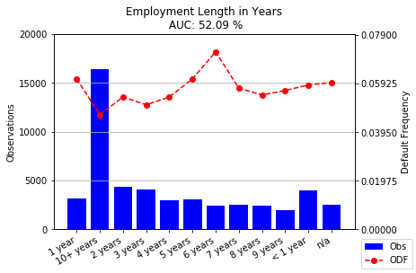

[](http://quantlet.de/)

## [](http://quantlet.de/) **varAUC** [](http://quantlet.de/)

```yaml

Name of QuantLet : varAUC

Published in : SPL

Description : Checks the predictive power of single characteristics.
              Shows the Observed default frequency across characteristic classes.

Keywords : 'logistic regression, AUC, odf, default risk'

Author : Tobias Blücher, Niklas Kudernak, Sydney Richards

```




### Pyhton Code:
```python

########## Statistical Programming Languagues SS 2018 ##########
########## Project: Credit Risk Scorecard in Python   ##########
########## Members: Tobias Blücher, Niklas Kudernak  ##########
##########          Sydney Richards                   ##########
########## 
# Project Design: To create a Scorecard to classify Customer   #
# Loan applications according to the characteristics of the   #
# applicant. While the grouping shall be done using a Logistic #
# Regression. The scorecard that is develop should be usable #
# by non statisticians, since Lending Club is a peer-to-peer   #
# platform.

#### Dataset: Kaggle Competition kaggle datasets download -d wendykan/lending-club-loan-data
#### Use the Kaggle API to download dataset files.
#### https://github.com/Kaggle/kaggle-api 
#### Link: https://www.kaggle.com/wendykan/lending-club-loan-data/data


#### Packages Required
import pandas as pd
import numpy as np
from sqlalchemy import create_engine
from sklearn import preprocessing 
from sklearn.metrics import roc_auc_score
import statsmodels.api as sm
import statsmodels.tools as smt
import matplotlib.pyplot as plt


######################## Step 1: Data Import ##################################                

### Set file path to local directory
data_path = 'C:\\Users\\sydma\\Dropbox\\Uni Sach\Master\\SoSe_18\\Statistical Programming Languages\\Topic\\Loan_Club\\'
### Connect to SQL engine
engine = create_engine('sqlite:///' + data_path +'database.sqlite')
### Load Dataset
df = pd.read_sql('SELECT * FROM loan' ,engine)

### Organize & First Look 
cols=sorted(df.columns)
df[cols[1:25]].head()
df.info()
### Drop iffy loan_status

status = ['Issued','Does not meet the credit policy. Status:Charged Off',
                    'Does not meet the credit policy. Status:Fully Paid']
df = df[~df['loan_status'].isin(status)]

############# Take sample and define default ###################

######################## Step 2: Create Sample ################################  

### create sample of 50000 obs with random_state(seed)
df_sample =df.sample(50000,random_state = 1)
### Only select useful columns
df_sample = df_sample[cols]

### Convert Date Cols
df_sample['last_pymnt_d'] = pd.to_datetime(df_sample['last_pymnt_d'])
df_sample['earliest_cr_line'] = pd.to_datetime(df_sample['earliest_cr_line'])
### latest obervation in dataset is '31/01/2016/' Calc Credit History
df_sample['final_snp_date'] =  pd.to_datetime('31/01/2016/')
### Length of Credit History in Years
df_sample['cr_hist_yr']=(df_sample['final_snp_date'].dt.to_period('M') - df_sample['earliest_cr_line'].dt.to_period('M')) / 12
### Convert to float 
df_sample['cr_hist_yr'] = df_sample['cr_hist_yr'].astype(float)


### Create default charactersitic: Default and 30+ dpd
print(df_sample['loan_status'].unique())
### Questions: What is charged off ? 
### Charged Off means in goes into collections 150+ dpd default
### Does not meet the credit policy ? 
pass_criteria = ['Current', 'Fully Paid','In Grace Period',
                    'Late (16-30 days)', 'Issued','Late (31-120 days)']

df_sample['default'] = np.where(np.isin(df_sample['loan_status'],pass_criteria),0,1)


################ A: Evaluating Characteristics #################################

# In order to evaluate characteristics we use the Area under Curve#
# of the Receiver Operating Characteristic for a single variable  #
# model. While such a model should not be                         #
# used for default prediction it allows use to judge whether or   #
# not to include the characteristic under consideration.          #
# As a rule of thumb a characteristic can be judged as follows:   #
# - AUC > 60 very powerful characteristic should definitely be    #
# 		included											      #
# - AUC > 55 powerful characteristic should be included even if   #
#		  correlated with another variable						  #
# - AUC > 52 moderate characteristic should if it adds new insight#
#		  into quality of loan applicant   						  #		
#		  correlated with another variable						  #
# The following functions are used throughout the script to       #
# for characteristic evaluation                                   #	


######## Function 1: Calculate Single VAR AUC ########
# Initially, we would like to now what is the Observed Default   #
# Frequency (ODF) for each attribute of a given characteristic.  #	
# We can than see if there are differences among the different   #
# Attributes of a the characteristic.                            #
#Input: pd.Series containing variable to be observed             #
#Output pd.Series containing ODFs with Attributes as index       #

def Calc_Default_Freq_Cat(cat_var):
    return df_sample['default'].groupby(cat_var).sum() / cat_var.value_counts()


######## Function 2: Calculate Single VAR AUC ########
# We measure the predictive power of the characteristic using AUC#
# For this we need to set up a Logistic_Regression_Analysis with #	
# a constant and a single characteristic.					     #
# Attributes of a the characteristic.                            #
# To this end we use the statsmodels package in Python which is  #
# concise and easy to implement.							     #
# For the model to work we need to encode the values of our      #
# characteristic.                                                #
# Our functions checks if the Matrix of characteristic and 		 #
# constant is non-singular and invertible                        #                                                		 #
#Input: pd.Series containing variable to be observed             #
#Output: scalar containing AUC Score                             #

def single_VAR_AUC(cat_var):
    #Label Encoder
    le = preprocessing.LabelEncoder()
    #Declare Variables
    y = df_sample['default']
    X = smt.add_constant(le.fit_transform(cat_var))
    # Regression Analysis
    if np.isfinite(np.linalg.cond(X)): # Check for non-singular matrix
        logit_model=sm.Logit(y,X)
        result=logit_model.fit(disp=0)
        
        X = le.fit_transform(cat_var)
        
        return round(roc_auc_score(y, result.predict())*100,2)
    else:
        print('Matrix is not invertible')
        return 0


######## Function 3: Create Histograms for Categorical Vars ########
# We visualize the the behavior of the ODFs across Attributes    #
# Ideally we look for large differences within groups.           #	
# Large Differences in the ODF among attributes imply that       #
# the characteristic can be used to discriminate between         #
# which will pay back their loan and applicants which will not.  #
# Ideally there exist a minimum "statistical mass" of            #
# observations in each attribute. Such that if the model is used #
# in the future these attributes do not become obsolete.         #
# The AUC is displayed above the chart.                          #
#Input: x: pd.Series containing variable to be observed          #
#       Title: Title of the Diagram                              #
#Output: Histogram with number of Observations and ODF across    #
#        Attributes												 #		
    
def hist_cat(x,Title):
    #call single_VAR_AUC function
    auc = single_VAR_AUC(x)
	#calculate ODF
    odf = Calc_Default_Freq_Cat(x).sort_index()
    freq_x = x.value_counts().sort_index()
    digits = len(str(max(freq_x)))-1
    fig, ax1 = plt.subplots()
	
    ax1.bar(freq_x.index.astype(str),freq_x, color='blue'
             ,alpha=1,label='Obs')
    ax1.set_title(Title + '\n AUC: ' + str(auc) +' %' )
    ax1.set_ylabel('Observations')
    ax1.yaxis.grid()
    plt.setp(ax1.get_xticklabels(), rotation=30, horizontalalignment='right')
    ax2 = ax1.twinx()
    ax2.plot(odf.index,odf,linestyle='--', marker='o', color='r',label='ODF')
    ax2.set_ylim(0,max(odf)*1.1)
    ax2.set_ylabel('Default Frequency')
    ax1.set_yticks(np.linspace(0, round(max(freq_x)*1.1,-digits), 5))
    ax2.set_yticks(np.linspace(0, round(max(odf)*1.1,3), 5))
    fig.legend(loc='lower right')
    plt.show()
    
    return

#Purpose
hist_cat(df_sample['purpose'],'Loan Purpose')
#Length of Employment
hist_cat(df_sample['emp_length'],'Employment Length in Years')


```